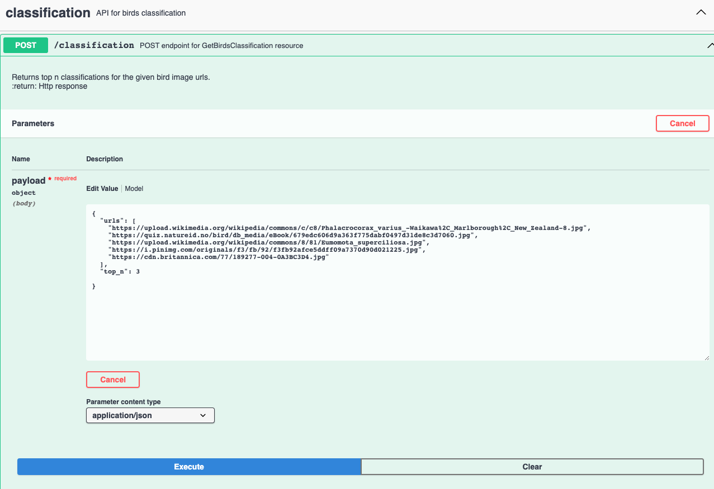
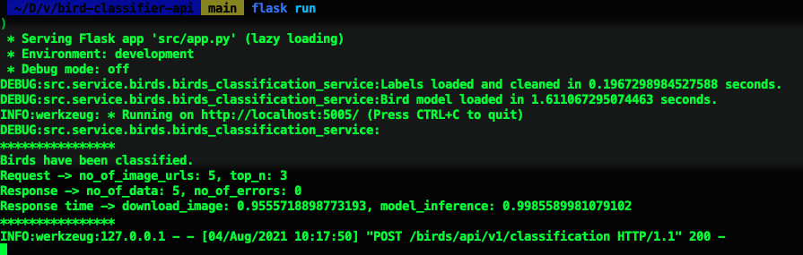
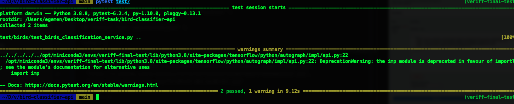

# Bird Classifier API

Many photographers have been taking images of birds and wondering what kind of bird it actually is.
This API helps its users to find species of given bird images. 

## How to run API?
1. Create a new virtual environment using your favorite solution like virtualenv and conda.
2. Install requirements to this environment,
    ```
   pip install -r requirements.txt 
   ```
3. Add following environment variables to your terminal session or IDE,
    ```
   PYTHONUNBUFFERED=1
   FLASK_APP=src/app.py
   ENVIRONMENT=dev
   FLASK_ENV=development
   AUTOGRAPH_VERBOSITY=0
   TF_CPP_MIN_LOG_LEVEL=3
   FLASK_RUN_HOST=localhost
   FLASK_DEBUG=0
   FLASK_RUN_PORT=5005
   ```
   Or you can use env_setter helper file if you are using Mac or Linux.
   ```
   source env_setter
   ```
4. Run the application,
    ```
    flask run
    ```

There is currently only one endpoint defined in the API,
```
birds/api/v1/classification
```
You can directly send a request to this endpoint using curl like,
```
curl -X 'POST' \
  'http://localhost:5005/birds/api/v1/classification' \
  -H 'accept: application/json' \
  -H 'Content-Type: application/json' \
  -d '{
  "urls": [
    "https://upload.wikimedia.org/wikipedia/commons/c/c8/Phalacrocorax_varius_-Waikawa%2C_Marlborough%2C_New_Zealand-8.jpg",
    "https://quiz.natureid.no/bird/db_media/eBook/679edc606d9a363f775dabf0497d31de8c3d7060.jpg",
    "https://upload.wikimedia.org/wikipedia/commons/8/81/Eumomota_superciliosa.jpg",
    "https://i.pinimg.com/originals/f3/fb/92/f3fb92afce5ddff09a7370d90d021225.jpg",
    "https://cdn.britannica.com/77/189277-004-0A3BC3D4.jpg"
  ],
  "top_n": 3
}'
```
or you can navigate to http://localhost:5005/birds/api/v1/ endpoint on your browser and use swagger,


You can follow the logs on your terminal,



## How to run tests?
Use pytest command,
```
pytest test/
```


If you have any question, please contact me from sarimadenegemen@gmail.com
